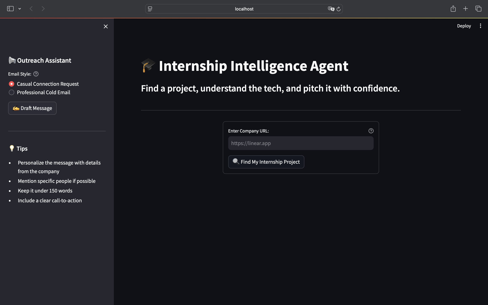
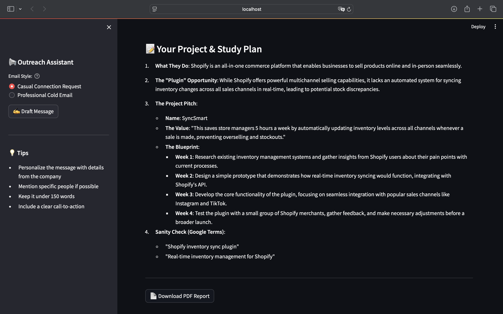
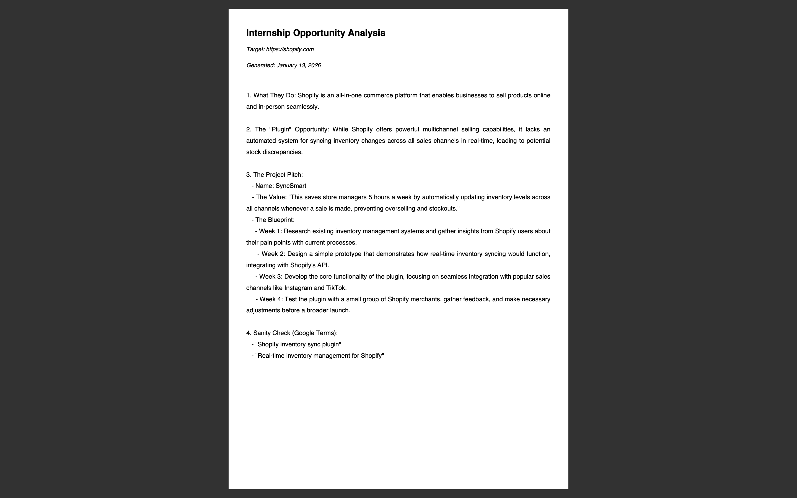

# AI Internship Intelligence Tool

I got tired of spending 30+ minutes researching each company for internship applications, so I built this tool to automate it.

## What It Does

Enter a company URL → Get a specific project idea you could pitch to them in 60 seconds.

The tool:
- Scrapes their website (homepage + about/blog/product pages)
- Uses OpenAI to analyze what they do and identify gaps
- Generates a concrete project proposal
- Creates a PDF report you can send
- Drafts an outreach email

## Why I Built This

I was applying to 100+ companies and couldn't personalize each application. This tool reduced my research time from 30 minutes to 6 minutes per company while maintaining quality.

**Results:** Analyzed 100+ companies in my first month using it.

## Tech Stack

- **Python** - Main application
- **Streamlit** - Web interface
- **BeautifulSoup** - Web scraping with retry logic
- **OpenAI API** - Content analysis
- **FPDF** - PDF generation

## Screenshots

### Main Interface

*Enter any company URL to analyze*

### AI-Generated Analysis

*Tool generates specific project proposals in 60 seconds*

### PDF Report

*Professional reports ready to send to hiring managers*

## How to Run It
```bash
# Clone and install
git clone https://github.com/marinasofia/sales-intelligence-tool.git
cd sales-intelligence-tool

# Create virtual environment
python3 -m venv venv
source venv/bin/activate

# Install dependencies
pip install -r requirements.txt

# Add your OpenAI key to .env file
echo "OPENAI_API_KEY=your_key_here" > .env

# Run
streamlit run app.py
```

Then go to `localhost:8501` and enter a company URL.

## Features I'm Proud Of

**Smart scraping:** Automatically finds and prioritizes important pages (about, blog, careers). Has retry logic so it doesn't break if a page times out.

**Better prompts:** Spent a lot of time making sure the AI doesn't suggest generic stuff. It checks if they already have the feature before suggesting it.

**Actually useful output:** The PDF reports look professional enough to send to hiring managers. The email drafts need editing but give you a solid starting point.

## What I Learned

- **Prompt engineering is harder than it looks.** Getting the AI to suggest *specific* projects instead of generic advice took iteration.
- **Web scraping needs good error handling.** Sites timeout, return 403s, have weird formatting. Built in retries and fallbacks.
- **PDF generation has encoding issues.** Had to handle special characters and markdown formatting.

## Limitations

- Only works on static sites (no JavaScript rendering yet)
- Costs ~$0.002 per analysis (OpenAI API)
- English sites only
- Takes 30-60 seconds per analysis

## Future Ideas

- Add Selenium for JavaScript-heavy sites
- Batch mode to analyze multiple companies at once
- Chrome extension for one-click analysis
- Cache results so I don't re-scrape the same company

## Contact

**Marina Sofia Martin**  
marinasofiaml@gmail.com | [LinkedIn](https://linkedin.com/in/marinasofiaml)

CIS @ Baruch College | Microsoft Certified: Fabric Analytics Engineer (DP-600)

Looking for Data Analyst / BI Analyst internships for Summer 2026.